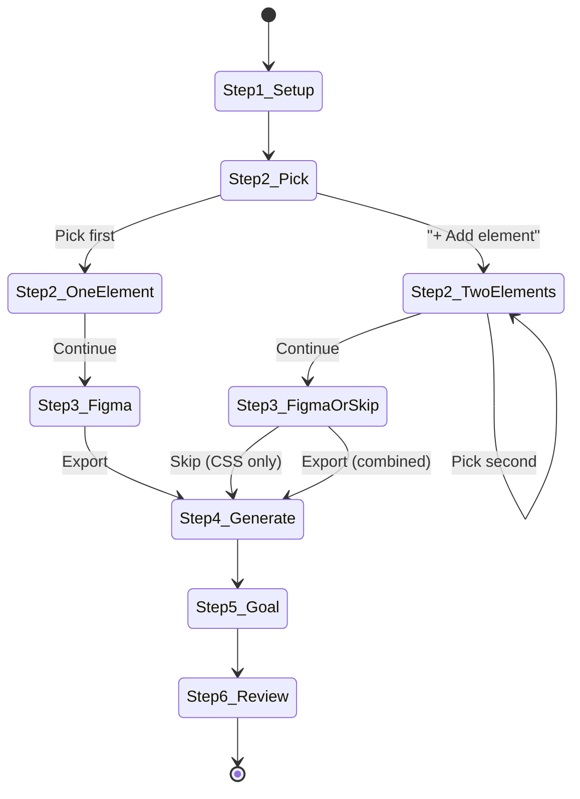

# `variant_b_css` — Layout & Position Testing

> Zweite Varianten-Achse: CSS-Injection statt DOM-Tausch. Für Reorder, Visibility, Spacing, Color — alles was kein neues HTML braucht.
>
> **Status: ✅ Implementiert** (2026-07-13) — DB-Migration, Backend, ab.js, Picker, Generate-Endpoint, Figma Plugin.

---

## 1. Architektur-Entscheidung

**`variant_b_css` als parallele Spalte, nicht als neuer Test-Typ.**

| Dimension | Feld | Lieferung | Mechanismus |
|---|---|---|---|
| Content | `variant_b_html` | `replaceWith()` | DOM-Tausch (heute) |
| Layout | `variant_b_css` (neu) | `<style>` in `<head>` | CSS-Injection (neu) |

Beide Felder können parallel existieren. Ein Test kann Content+Layout kombinieren.

**Warum kein Enum/Test-Typ:** Der Designer soll nicht vordenken müssen ob's Content oder Layout ist. Die AI klassifiziert automatisch was sich geändert hat und befüllt das passende Feld. Der Wizard bleibt ein einziger Flow.

---

## 2. DB-Migration

```sql
ALTER TABLE tests ADD COLUMN variant_b_css TEXT;
```

Feld ist nullable, rückwärtskompatibel. Kein bestehender Test betroffen.

Zu patchende Felder in `PATCH /api/tests/[id]`:
- `variant_b_css` hinzufügen (same rules wie `variant_b_html`)

---

## 3. `ab.js` — Client-Änderungen

### 3.1 Neue Funktion `applyCss(key, css)`

```js
function applyCss(key, css) {
  if (!css) return
  var style = document.createElement('style')
  style.setAttribute('data-ab-css', key)
  style.textContent = css
  document.head.appendChild(style)
}
```

### 3.2 `applyTest(t)` erweitern

Read `t.variant_b_css`. Rufe `applyCss()` parallel zu `applyDom()` auf:

```js
function applyTest(t) {
  // ... existing logic ...

  function finish(variant, cachable) {
    if (variant === 'B') {
      // CSS zuerst (nicht vom Element abhängig), dann HTML
      applyCss(t.snippet_key, t.variant_b_css)
      applyDom(selector, variant, t.variant_b_html, t.snippet_key)
    }
    // ... goal registration unchanged ...
  }

  // force===B: CSS auch im Winner-Modus ausliefern
  if (t.force === 'B') {
    applyCss(t.snippet_key, t.variant_b_css)
    if (t.variant_b_html) applyDom(selector, 'B', t.variant_b_html, key)
    return Promise.resolve()
  }

  // Caching: variant_b_css muss mit im localStorage landen
  // ... existierende A/B-Logik, aber beim Cachen CSS mitspeichern ...
}
```

### 3.3 Caching im localStorage

Payload erweitern:

```js
lsSet('ab_' + key, JSON.stringify({
  variant: 'B',
  html: t.variant_b_html,
  css: t.variant_b_css     // ← neu
}))
```

### 3.4 `resolve` Endpoint

Query um `variant_b_css` erweitern:

```ts
// resolve/route.ts — select ergänzen
.select('snippet_key, selector, goal, status, site_url, winner, traffic_split, variant_b_html, variant_b_css, user_id')
```

Rückgabe-Objekt ergänzt um `variant_b_css`.

---

## 4. Figma Plugin — Wizard-Integration

### 4.1 Designprinzipien

- **Kein Modus-Dialog.** Der Designer wählt nicht vorab "Content oder Layout" — das ist Sache der Maschine.
- **90%-Case unverändert.** Wer einen normalen Content-Test macht, merkt nichts von der neuen Fähigkeit.
- **Entdeckung passiert natürlich.** "+ Add element" ist ein kleiner Secondary-Button, den man entweder sofort versteht oder ignoriert.
- **Figma bleibt, wird aber optional.** Der Designer *kann* immer noch in Figma arbeiten — auch beim Reorder. Oder nicht.
- **AI schlägt vor, Designer bestätigt.** Konkrete Vorschläge statt abstrakter Modi.

### 4.2 Flow als Zustandsmaschine



### 4.3 Step 2/6 — Pick Element (erweitert)

Der heutige Screen bleibt bis auf einen Punkt unverändert: Nach erfolgreichem Element-Pick erscheint ein kleiner Secondary-Button.

**Nach erstem Pick:**

```
┌─────────────────────────────────────┐
│ ✓ Element captured                  │
│ ┌─────────────────────────────────┐ │
│ │ BUTTON  #hero-cta               │ │
│ └─────────────────────────────────┘ │
│                                     │
│ [Reselect]     [+ Add element]      │  ← NEU: unaufdringlich
│                                     │
│            [Continue →]             │
└─────────────────────────────────────┘
```

"+ Add element" öffnet den Picker erneut mit `?ab_pick=<testId>&ab_reorder=1`. Der Picker zeigt Banner "Pick element to swap with (ESC cancels)" und markiert das erste Element visuell.

**Nach zweitem Pick — AI-Vorschlag inline:**

```
┌─────────────────────────────────────┐
│ ✓ 2 elements selected               │
│ ┌─────────────────────────────────┐ │
│ │ BUTTON  #hero-cta               │ │
│ │ DIV     .calculator-section     │ │
│ └─────────────────────────────────┘ │
│ Swap order: Hero CTA ↔ Calculator   │  ← AI-Vorschlag, inline
│                                     │
│ [Reselect]     [Remove element]     │
│                                     │
│            [Continue →]             │
└─────────────────────────────────────┘
```

Der "Swap order"-Vorschlag kommt von einem leichten `/api/suggest-reorder` Call, der nur die Parent-Beziehung prüft und einen menschenlesbaren Vorschlag zurückgibt. Keine schwere AI, kein Latenzproblem. Designer klickt "Continue" → akzeptiert.

### 4.4 Step 3/6 — Variant B in Figma (adaptiv)

**Ohne zweites Element (heute):** Unverändert. "Click any layer in Figma that represents Variant B." Exportiert als PNG, `extractNode()` läuft.

**Mit zweitem Element (neu):**

```
┌─────────────────────────────────────┐
│ Layout swap: Hero ↔ Calculator      │
│                                     │
│ The AI will swap their order.       │
│ No Figma redesign needed.           │
│                                     │
│ [Skip — generate CSS only]  ←───────│  Hauptpfad für Reorder
│                                     │
│ ── or ──                            │
│                                     │
│ Also redesign elements in Figma:    │
│ "Click a layer in Figma…"           │  Gleicher Flow wie heute,
│ [Selected: Button v2]               │  aber optional
│                                     │
│ [Generate combined variant →]       │
└─────────────────────────────────────┘
```

Zwei klare Optionen, kein entweder-oder-Zwang:
- **Schnellpfad:** "Skip" → direkt CSS, kein Figma nötig. Der Wizard springt zu Step 4 mit `mode: "reorder"`.
- **Kombipfad:** Zusätzlich in Figma redesignen. Der gewohnte `EXPORT_SELECTION`-Flow läuft wie heute. Step 4 bekommt `mode: "both"`.

### 4.5 Step 4/6 — Generate (adaptiver Prompt)

Ein Screen, ein Endpoint, adaptiver Prompt:

| Input | Prompt-Schwerpunkt | Output-Felder |
|---|---|---|
| 1 Element + Figma-PNG + `extractNode()` | "Generate HTML matching the Figma redesign" | `variant_b_html` |
| 2 Elemente, kein Figma | "Generate CSS to swap these two sibling elements" | `variant_b_css` |
| 2 Elemente + Figma-PNG + `extractNode()` | "Generate HTML for redesigned elements AND CSS for new order" | `variant_b_html` + `variant_b_css` |

Der Generate-Endpoint bekommt ein Feld `mode` (`"content"` | `"reorder"` | `"both"`) und einen optionalen `selector_b` für das zweite Element.

**Preview für reine CSS-Tests:**

Der Preview-Renderer kann CSS nicht visuell darstellen (bräuchte den echten DOM). Stattdessen:

```
┌─────────────────────────────────┐
│ Generated CSS                   │
│ ┌─────────────────────────────┐ │
│ │ .hero-wrapper {             │ │
│ │   display: flex;            │ │
│ │   flex-direction: column;   │ │
│ │ }                           │ │
│ │ .hero-wrapper > :first-child│ │
│ │ { order: 2; }               │ │
│ │ .hero-wrapper > :last-child │ │
│ │ { order: 1; }               │ │
│ └─────────────────────────────┘ │
│ ✓ This CSS will be injected     │
│   without touching your DOM     │
│                                 │
│ [Refine with AI]                │
│ [Continue to Goal →]            │
└─────────────────────────────────┘
```

Bei kombinierten Tests (HTML + CSS): HTML-Vorschau wie heute, CSS als zusätzlicher Code-Drawer darunter.

---

## 5. AI-Klassifizierung (Generate-Endpoint)

Der Generate-Endpoint (`/api/generate` oder vergleichbar) erkennt automatisch:

| Eingabe | Klassifizierung | Output |
|---|---|---|
| 1 Element + Figma-Redesign | Content | `variant_b_html` |
| 2 Elemente, selber Parent, keine Figma-Änderung | Reorder | `variant_b_css` |
| 2 Elemente, selber Parent, + Figma-Redesign | Combined | `variant_b_html` + `variant_b_css` |
| 2 Elemente, verschiedene Parents | DOM-Reorder (Phase 2) | `variant_b_html` (Parent-Tausch) |

---

## 6. Was bewusst *nicht* gemacht wird (Phase 2)

- **DOM-Reorder (`insertBefore`):** Zwei Elemente in verschiedenen Parents zu vertauschen erfordert physische DOM-Manipulation, die bei React-Hydration zerbricht. CSS kann das nicht. Für Phase 2, wenn Nachfrage da ist.
- **`variant_b_js`:** JS-Injection für Verhaltens-Tests (z.B. andere Animation, andere Interaktion). Braucht Content-Security-Policy-Überlegungen.
- **Multivariate Tests (C, D, ...):** Bleibt bei A/B. 95% der Use Cases sind A/B.

---

## 7. Implementierungs-Reihenfolge

| # | Schritt | Aufwand | Details |
|---|---|---|---|
| 1 | DB-Migration `variant_b_css TEXT` | 5 min | `ALTER TABLE tests ADD COLUMN` |
| 2 | Neues Feld `reorder_selector` in `tests` | 5 min | Zweiter CSS-Selektor für Swap-Partner |
| 3 | `resolve`-Endpoint: `variant_b_css` + `reorder_selector` | 10 min | Query erweitern, Rückgabe erweitern |
| 4 | `PATCH /api/tests/[id]`: beide Felder erlauben | 5 min | `typeof`-Checks analog `variant_b_html` |
| 5 | `ab.js`: `applyCss()`, Cache, `applyTest()` | 15 min | `<style>`-Injection + localStorage-Erweiterung |
| 6 | `ab.js` Picker: `ab_reorder=1` Modus | 10 min | Zweites Banner, visuelle Markierung Element A |
| 7 | `/api/suggest-reorder` Endpoint | 15 min | Prüft Parent-Beziehung, liefert menschenlesbaren Vorschlag |
| 8 | Figma Plugin: "+ Add element" Button (Step 2) | 15 min | HTML + JS für zweiten Picker-Call |
| 9 | Figma Plugin: "Swap order"-Vorschlag inline (Step 2) | 10 min | Fetch `suggest-reorder`, anzeigen |
| 10 | Figma Plugin: Skip/Design-Entscheidung (Step 3) | 15 min | Konditionaler Screen mit zwei Pfaden |
| 11 | Figma Plugin: CSS-Preview + HTML/CSS-Drawer (Step 4) | 15 min | Adaptiver Preview je nach `mode` |
| 12 | Generate-Endpoint: `mode` + `selector_b` + adaptiver Prompt | 20 min | Prompt-Builder je nach Input-Kombination |

**Total: ~140 min (2.5h)**

---

## 8. Entscheidungen & offene Fragen

### Geklärt

- **`reorder_selector` als eigenes Feld:** Ja, separates Feld in `tests`. Der originale `selector` bleibt für A unverändert, `reorder_selector` ist der Swap-Partner.
- **Picker-Modus `ab_reorder=1`:** URL-Parameter im zweiten Picker-Call. Der Picker zeigt dann "Pick element to swap with" und sendet den zweiten Selektor als `selector_b` an den Server.
- **Kein Modus-Dialog am Anfang:** Der Designer wird nicht gefragt "Content oder Layout?". Die Fähigkeit entfaltet sich über den "+ Add element" Button.
- **Nur-`variant_b_css` ohne `variant_b_html`:** `applyCss()` läuft alleine, `applyDom()` wird nicht aufgerufen. Kein DOM-Touch, nur `<style>`-Injection.
- **Winner-Modus (force=B):** CSS wird auch im Winner-Modus ausgeliefert — `applyCss()` immer, `applyDom()` nur wenn HTML existiert.

### Offen

- **Mehr als zwei Elemente?** Theoretisch denkbar (z.B. 3 Cards reshufflen), aber YAGNI. Die 95% sind zwei Siblings. Bei Bedarf in Phase 2.
- **`variant_b_css` sanitizen?** CSS-Injection ist mächtig — theoretisch könnte ein `url()` externen Content laden. Praktisch: die AI generiert das CSS, kein User-Input. `sanitizeHtml()` auf CSS anwenden wäre overkill. Bei Bedarf `style-src` CSP erwägen.
- **`suggest-reorder` Caching?** Der Endpoint macht nur einen einfachen DOM-Struktur-Check — keine schwere AI, kein Caching nötig.
